# Perspectives on Generative Artificial Intelligence{background-iframe="multiple-images/index.html"}

## :wave: About me -- Dr Mac Misiura 

::::{.columns} 
::: {.column width=50%}
{width="550" height="550"}
:::
::: {.column width=50%}
:mortar_board: Obtained a PhD in Applied Mathematics and Statistics from Newcastle University 

:computer: Worked as a Data Scientist at the [the National Innovation Centre for Data](https://www.nicd.org.uk/) until August 2024

:tophat: Currently working as a Senior Machine Learning Engineer at Red Hat

:sparkling_heart: Particularly interested in: 

- __safe__ and __reliable__ use of Generative AI
 
:::
::::

## :wave: About me -- Dr Mac Misiura

If I wasn't doing language modelling, I would be doing hand modelling

{width="600" height="600" fig-align="center"}

# :keycap_ten: Starter for ten

## :raised_hand: What is Artificial Intelligence ? {.smaller}

::: {.fragment .fade-in-then-semi-out .shrink}
One of the earliest definitions of __AI__ could be traced back to [John McCarthy](https://hai.stanford.edu/sites/default/files/2020-09/AI-Definitions-HAI.pdf):

> the science and engineering of making intelligent machines
:::

::: {.fragment .fade-in-then-semi-out .shrink}
[the European Commission](https://eur-lex.europa.eu/legal-content/EN/TXT/?uri=CELEX:52021PC0206) is currently defining __AI__ as:

> a machine-based system that is designed to operate with varying levels of autonomy and that can, for explicit or implicit objectives, generate output such as predictions, recommendations, or decisions influencing physical or virtual environments
:::

::: {.fragment .fade-in-then-semi-out .shrink}
[Google](https://cloud.google.com/learn/what-is-artificial-intelligence) defines __AI__ as: 

> a field of science concerned with building computers and machines that can reason, learn, and act in such a way that would normally require human intelligence or that involves data whose scale exceeds what humans can analyze 
:::

::: {.fragment .fade-up}
[Stuart J. Russell](https://www.mckinsey.com/capabilities/quantumblack/our-insights/why-we-need-to-rethink-the-purpose-of-ai-a-conversation-with-stuart-russell) defines __AI__ as:

> building machines that do the right thing, that act in ways that can be expected to achieve their objectives
:::

## :raised_hand: What is Artificial Intelligence ?

Based on the aforementioned definition, __AI__ is many things, e.g.:

::::{.columns}

::: {.column width="33.33%"}
:::{.fragment .fade-up}
{width="450px"}
:::
:::

::: {.column width="33.33%"}
:::{.fragment .fade-up}
{width="450px"}
:::
:::

::: {.column width="33.33%"}
:::{.fragment .fade-up}
{height="230px"}
:::
:::
::::

::: {.fragment .fade-up}
The RHS example leverages a __machine learning model__
:::

## :raised_hand: What is Machine Learning (ML)? {.smaller}

{fig-align="center" height=300}

::: {.fragment .fade-up}
> [Arthur L. Samuel](https://www.semanticscholar.org/paper/Some-Studies-in-Machine-Learning-Using-the-Game-of-Samuel/e9e6bb5f2a04ae30d8ecc9287f8b702eedd7b772?p2df): __ML__ is the field of study that gives computers the ability to learn without being explicitly programmed
:::

::: {.fragment .fade-up}
> [Tom M. Mitchell](https://sebastianraschka.com/pdf/lecture-notes/stat479fs18/01_ml-overview_slides.pdf): a computer program is said to learn from experience $E$ with respect to some class of tasks $T$ and performance measure $P$, if its performance at tasks in $T$, as measured by $P$, improves with experience $E$
::: 

<p class="footnote">
_image generated using [Stable Diffusion v2](https://huggingface.co/stabilityai/stable-diffusion-2) with a prompt: `a robot during their graduation ceremony looking happy`_<p>

## :pager: Machine Learning: an example

{fig-align="center" height=350}

- __Task, T__: sentiment analysis of social media posts
- __Training, E__: social media posts along with their corresponding sentiment labels
- __Performance Measure, P__: accuracy of correctly classifying the sentiment of social media posts, as judged by comparing the predicted labels with human-labeled sentiment

<p class="footnote">
_image generated using [Stable Diffusion v2](https://huggingface.co/stabilityai/stable-diffusion-2) with a prompt: `a dashboard with three emojis: angry, neutral, happy`_<p>

## :raised_hand: What is Deep Learning (DL)?

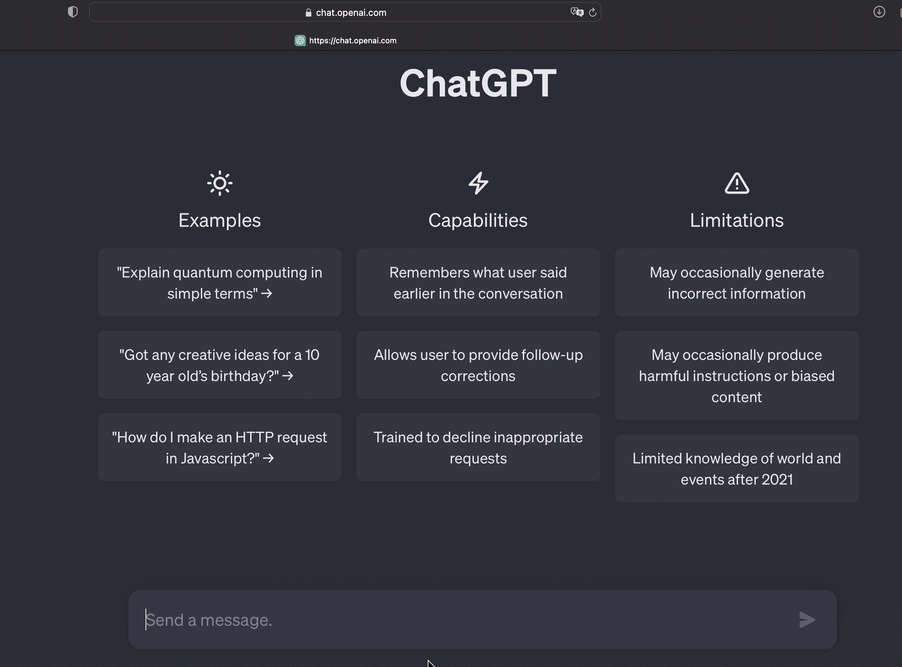{fig-align="center" height=450}

> [Yann LeCun](https://www.facebook.com/722677142/posts/10156463919392143/): __DL__ is constructing networks of parameterized functional modules & training them from examples using gradient-based optimization

## :raised_hand: What is Generative Artificial Intelligence?

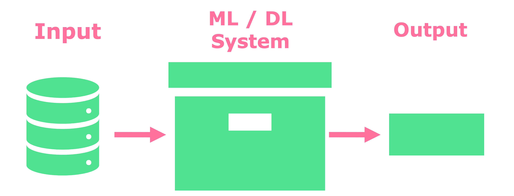{fig-align="center" height=450}

Generative Artificial Intelligence (__GenAI__) refers to the use of models that can generate new data, like text, images, music and audio

## :book: GenAI examples: text-2-text

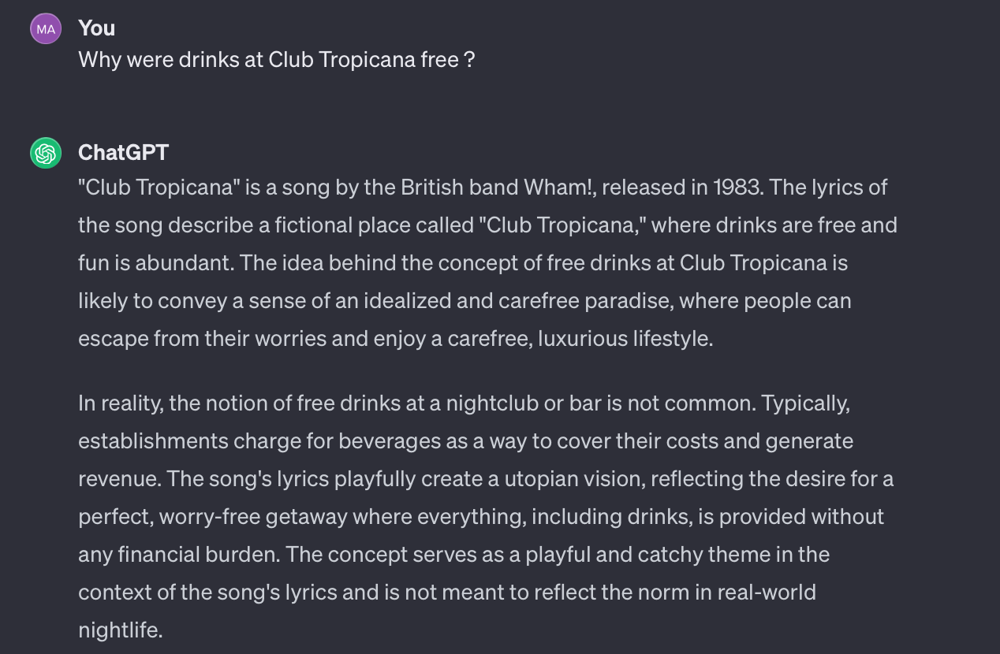{fig-align="center" height="600"}

<p class="footnote">
_text generated using [ChatGPT 3.5](https://chat.openai.com) with a prompt: `Why were drinks at Club Tropicana free?`_ <p>

## :rice_scene: GenAI examples: text-2-image

{fig-align="centre" width="1200" height="585"}

<p class="footnote">
_image generated using [DALL·E 3](https://openai.com/dall-e-3) with a prompt: `photorealistic image of a person in business attire running through fields of wheat` and extended with Runway's [Expand Image](https://runwayml.com/ai-magic-tools/infinite-image/)_ <p>

## :rice_scene: GenAI examples: text-2-image (contd)

::: {.r-stack}
{width="700" height="625"}

{.fragment width="700" height="625"}
:::

<p class="footnote">
_images generated using [textual-inversion fine-tuning for Stable Diffusion](https://colab.research.google.com/github/huggingface/notebooks/blob/main/diffusers/sd_textual_inversion_training.ipynb#scrollTo=tAZq3vFDcFiT)_ | model with a learnt concept of `Me` is available on [Hugging Face](https://huggingface.co/sd-concepts-library/mac-mac)<p>

## :pencil2: GenAI examples: image-2-text {.scrollable}

::::{.columns}

::: {.column width=50%}
__Input image__:

{fig-align="center" height="625" width="700"}
:::

::: {.column width=50%}
__Output description__:

> The scene features a brown teddy bear wearing pink clothing. It is sitting on the floor, possibly posing for an outfit or simply rested there by someone who placed it next to them while they were seated nearby at another location within their home environment. The teddy bear is looking directly at the camera, and the background is a light-coloured wall with a few decorations on it. The lighting is soft and warm, and the overall atmosphere is calm and peaceful. The teddy bear is the main focus of the image, and it is the only object in the frame. The image is well-composed and aesthetically pleasing, and it conveys a sense of comfort and tranquillity.
:::
::::

<p class="footnote">
_text generated using [LLaVa](https://huggingface.co/docs/transformers/main/en/model_doc/llava) with a prompt: `Describe this image in less than 150 words` _<p>

## :microphone: GenAI examples: text-2-audio 

::::{.columns}
::: {.column width=70%}
{fig-align="center" height=600}
:::

::: {.column width=30%}
```{python}
#| echo: false
#| output: true

from IPython.display import Audio, display

display(Audio("img/gucci-salad.mp3"))
```
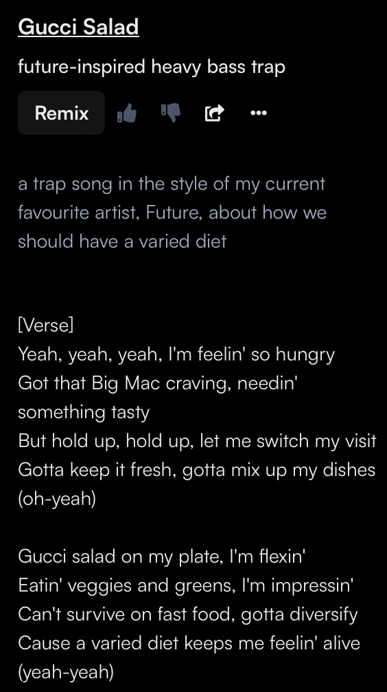{fig-align="left" height=525}
:::
::::

<p class="footnote">
_audio generated using [Suno AI](https://app.suno.ai/) with a prompt: `a trap song in the style of my current favourite artist, Future, about how we should have a varied diet`_ <p>

## :movie_camera: GenAI examples: text-2-video

<video data-autoplay muted loop src="img/sunset.mp4"></video>

<p class="footnote">
_video generated using [Runway Gen-2](https://research.runwayml.com/gen2) with a prompt: `a sunset over Lake Como`_<p>

## :doughnut: GenAI examples: text-2-3D

{fig-align="center" height=600}

<p class="footnote">
_3D asset generated using [Meshy](https://app.meshy.ai/discover) with a prompt: `a running shoe`_<p>

# :thought_balloon: How did we get here?

## :clock230: Timeline and key breakthroughs

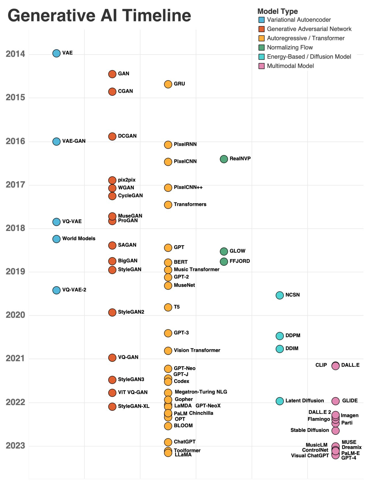{fig-align="center" height=500}

While __GenAI__ models have been around for a while, their recent success could be attributed to a __several key breakthroughs__ 

<p class="footnote">
_picture taken from [David Foster](https://www.linkedin.com/feed/update/urn:li:activity:7044233450295316480/)_<p>

## :bulb: Breakthrough 1: foundation models

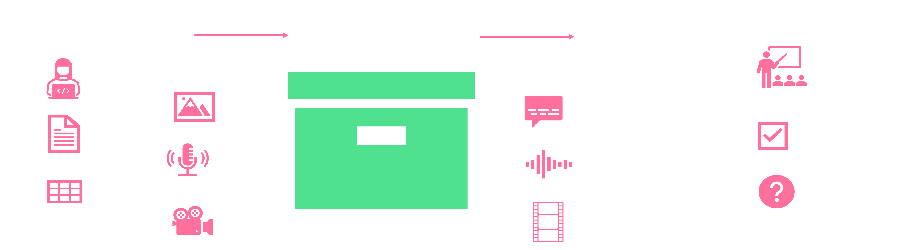{fig-align="center" height=350}

:school: [Foundation models](https://arxiv.org/pdf/2108.07258.pdf) is a paradigm shift in the AI research from developing task-specific models trained on narrow data to developing multi-purpose models trained on broad data

:tongue: Large language models (__LLMs__) could be viewed as a subset of foundation models that deal only with text

## :bulb: Breakthrough 2: winning recipe for training 

Zeroing in on :trophy: _the winning recipe_ for building __a good foundation model__: 

\begin{equation}
\boxed{
\begin{array}{c}
\textit{winning recipe} \\
= \\
\textbf{huge amounts of easy to acquire data} \\
\times \\
\textbf{a simple, high-throughput way to consume it}
\end{array}
}
\end{equation}

## :bulb: Breakthrough 2a: self-supervised learning

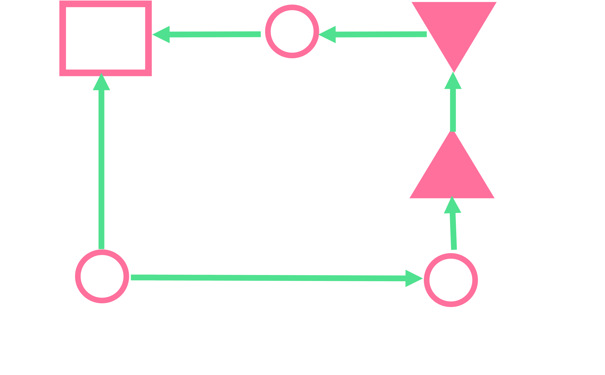{fig-align="center" height=450}

:scroll: Originally conceived in the [1980s](https://ai.facebook.com/blog/self-supervised-learning-the-dark-matter-of-intelligence/), revived in [2008 by researchers at the University of Montreal](https://www.cs.toronto.edu/~larocheh/publications/icml-2008-denoising-autoencoders.pdf) and popularised by the [BERT paper](https://arxiv.org/abs/1810.04805) in 2018

:dart: Aims to reconstruct the input or predict missing parts of the input

## :raised_hand: What does pre-training learn ?

While language modelling appears simple, it is a very powerful technique to learn a wide range of things since input sequences can contain any type of information, for example:

```python
# Example 1: Syntax
"The quick brown fox jumps <mask> the lazy dog"

# Example 2: Trivia / Knowledge
"Newcastle University is located in <mask>"

# Example 3: Sentiment
"I've never laughed so much during a trip to the cinema. The Barbie movie was <mask>"

# Example 4: Coreference
"Will Ferrell stole the show in this movie. <mask> is such a good actor"

# Example 5: Mathematics
"I was thinking about the sequence that goes 1, 1, 2, 3, 5, 8, 13, 21, <mask>"
```

## :raised_hand: Where does the data come from ?

::::{.columns}

::: {.column width=50%}
{fig-align="center" height="600" width="700"}
:::

::: {.column width=50%}
The data used to pre-train language models is usually obtained from the internet, for example:

- [Big Science Corpus](https://huggingface.co/spaces/bigscience/BigScienceCorpus?source=wudaocorpora)
- [Pushshift Reddit Data](https://arxiv.org/pdf/2001.08435.pdf)
- [CommonCrawl](https://commoncrawl.org)
- [BookCorpus](https://github.com/soskek/bookcorpus)
- [The Pile](https://pile.eleuther.ai)
:::
::::

## :bulb: Breakthrough 2b: finding the right architecture

::::{.columns}

::: {.column width=35%}
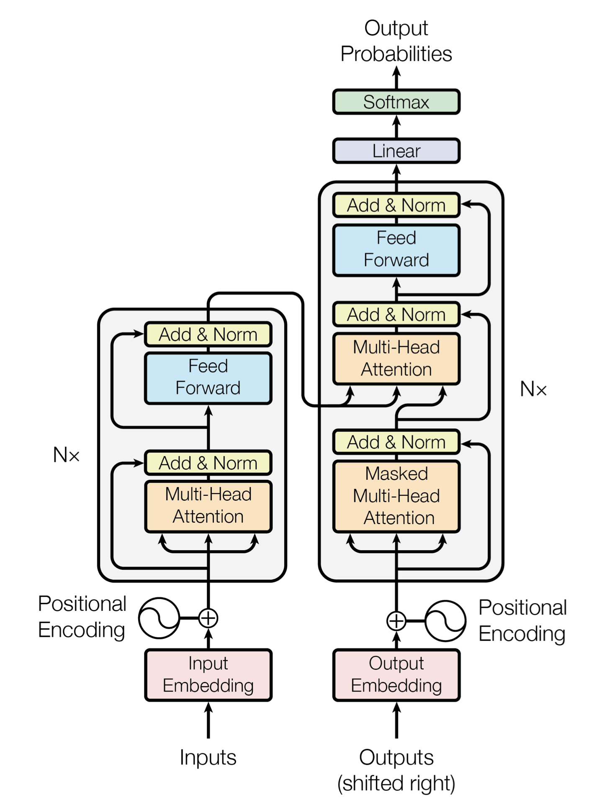{fig-align="center" height=600}
:::

::: {.column width=65%}
__Transformers__ are particularly successful due to:

- __attention__: captures contextual relationships between words, allowing to understand the importance of each word in the context of the entire input
- __positional encodings__: retains information about the order of words in the input sequence, enabling effective handling of sequential information
- __parallel computation__: can process the entire input sequence simultaneously, making them computationally efficient and enabling faster training and inference unlike sequential nets (e.g. RNNs)
:::

::::

<p class="footnote">
_figure taken from [Attention Is All You Need](https://arxiv.org/pdf/1706.03762.pdf)_<p>

## :bulb: Breakthrough 3: scaling-up {.smaller}

::::{.columns}

::: {.column width=35%}
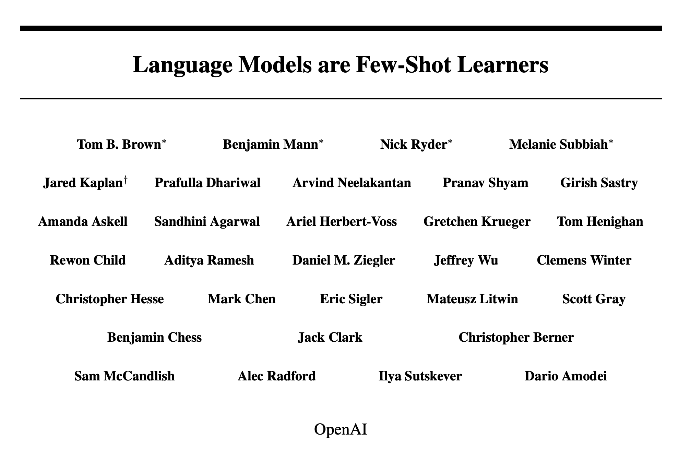{fig-align="center" height=400}
:::

::: {.column width=65%}
In 2020, [Brown and colleagues](https://arxiv.org/pdf/2005.14165.pdf) report the following:

> Here we show that scaling up language models greatly improves task-agnostic, few-shot performance, sometimes even reaching competitiveness with prior state-of-the-art fine-tuning approaches. Specifically, we train GPT-3, an autoregressive language model with 175 billion parameters, 10x more than any previous non-sparse language model, and test its performance in the few-shot setting. For all tasks, GPT-3 is applied without any gradient updates or fine-tuning, with tasks and few-shot demonstrations specified purely via text interaction with the model. GPT-3 achieves strong performance on many NLP datasets, including translation, question-answering, and cloze tasks, as well as several tasks that require on-the-fly reasoning or domain adaptation, such as unscrambling words, using a novel word in a sentence, or performing 3-digit arithmetic. At the same time, we also identify some datasets where GPT-3’s few-shot learning still struggles, as well as some datasets where GPT-3 faces methodological issues related to training on large web corpora
:::
::::

## :bulb: Breakthrough 3: scaling-up 

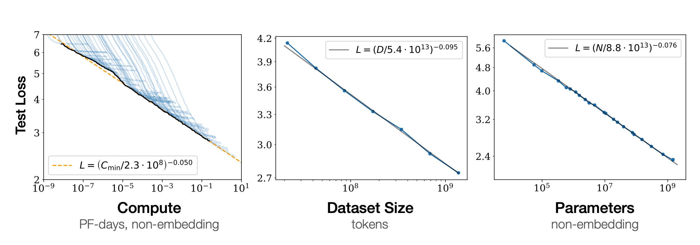{fig-align="center" height=275}

In 2020, [J. Kaplan and colleagues](https://arxiv.org/pdf/2001.08361.pdf) demonstrated that the performance of Large Language Models appears to improve with scaling:

- __compute__
- __data__
- __model size__

<p class="footnote">_figure taken from [Scaling Laws for Neural Language Models](https://arxiv.org/pdf/2001.08361.pdf/)_<p>

## :bulb: Breakthrough 3: scaling-up -- model size

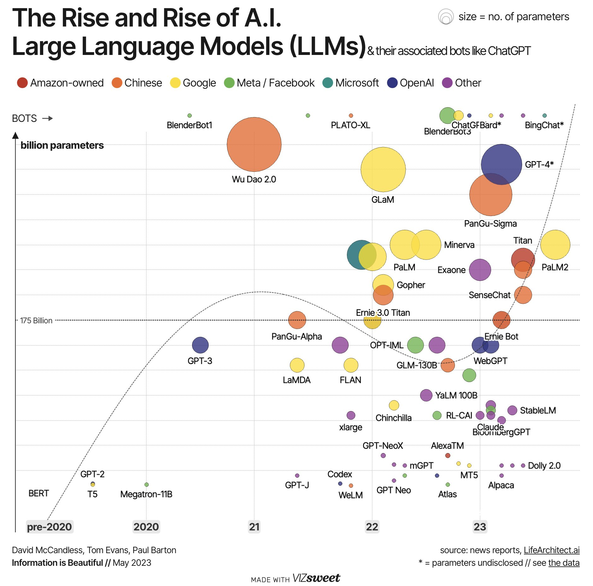{fig-align="center" height=600}

<p class="footnote">_figure taken from [ChatGPT, GenerativeAI and LLMs Timeline](https://github.com/hollobit/GenAI_LLM_timeline)_<p>

## :bulb: Breakthrough 3: scaling-up -- data size

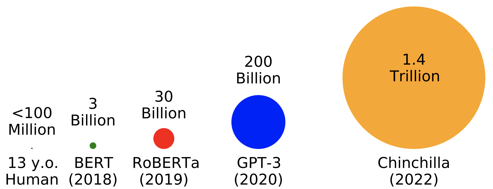{fig-align="center" height=500}

<p class="footnote">_figure taken from [BabyLM Challenge](https://babylm.github.io/)_<p>

## :hatching_chick: Emergent abilities

{height=550}

<p class="footnote">_animation taken from [Pathways Language Model (PaLM): Scaling to 540 Billion Parameters for Breakthrough Performance](https://ai.googleblog.com/2022/04/pathways-language-model-palm-scaling-to.html)_<p>

## :bulb: Breakthrough 4: from LLMs to assistants

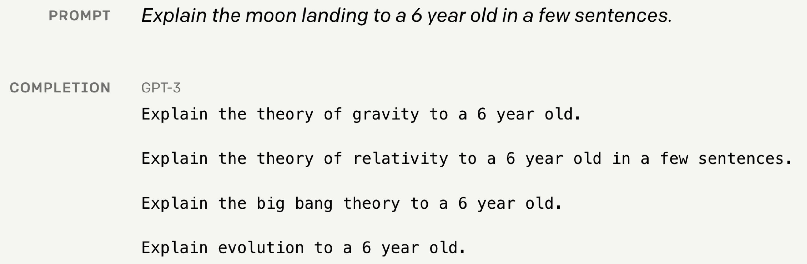{fig-align="center" height=350}

:x: Not all LLMs are great assistants. 

:white_check_mark: To be a good assistant, LLMs should:

- __respond to human instructions__
- __perform complex reasoning__
- __generalise to unseen instructions__

## :bulb: Breakthrough 4: from LLMs to assistants 

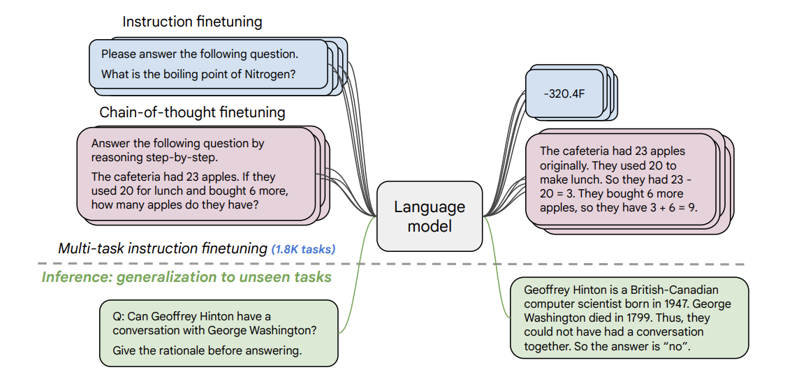{fig-align="center" height=450}

__Instructions__: finetuning on tasks phrased as instructions seems to improve zero-shot learning and the ability to follow instructions 

<p class="footnote">_figure taken from [Scaling Instruction-Finetuned Language Models
](https://arxiv.org/pdf/2210.11416.pdf)_<p>

# :thought_balloon: Where are we going?

## :link: GenAI value chain

[McKinsey & Company](https://www.mckinsey.com/capabilities/mckinsey-digital/our-insights/what-every-ceo-should-know-about-generative-ai) describes an emergence of a following __value chain__:

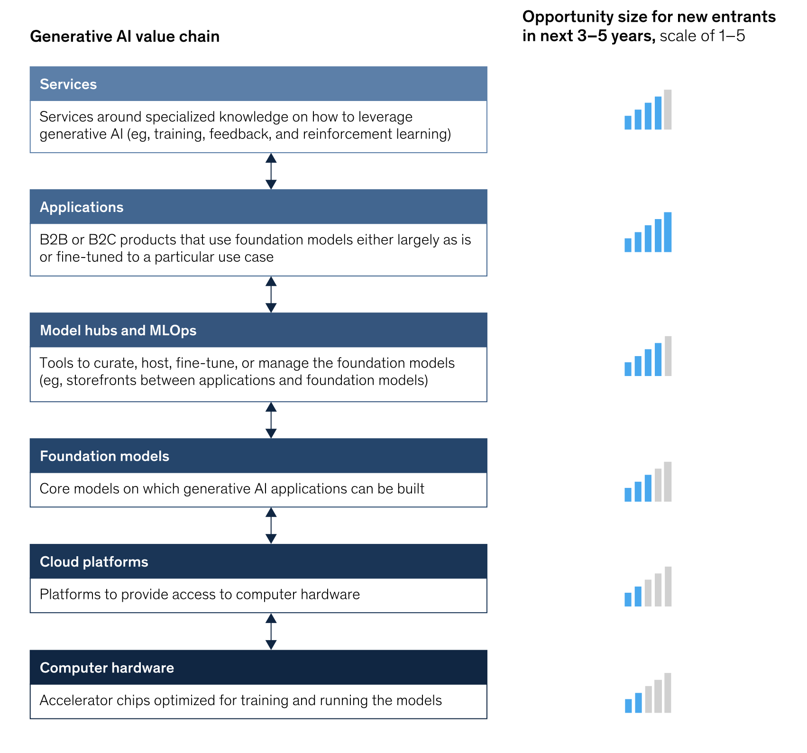{fig-align="center" height=550}

<p class="footnote">
_figure taken from [What every CEO should know about Generative AI](https://www.mckinsey.com/capabilities/mckinsey-digital/our-insights/what-every-ceo-should-know-about-generative-ai)_<p>

## :womans_clothes: Patterns for developing GenAI applications 

{fig-align="center" height=350}

Currently, most interesting GenAI applications leverage __LLMs__ and seem to follow one of the three main patterns:

1. __chatbot__
2. __retrieve & generate__
3. __agent / assistant__

## :slot_machine: Pattern 1: "chatbot" {auto-animate="true"}

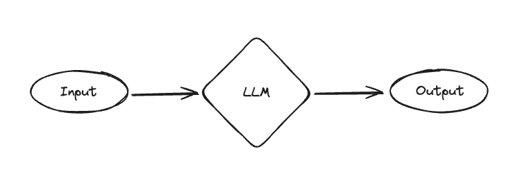{fig-align="center"}

LLMs generate responses to users' inputs without any external knowledge

## :slot_machine: Pattern 1: "chatbot" {auto-animate="true"}

{height=150 .absolute right=0 top=0}

:::{style="margin-top: 100px"}
While this is the simplest pattern, it is usually effective for a wide range of standard __natural language processing__ tasks, including:

- summarisation
- translation
- sequence / token classification
- generating conversation text
:::

However, __hallucinations__ can be a notable problem

## :shirt: Pattern 2: "retrieve & generate" {auto-animate="true"}

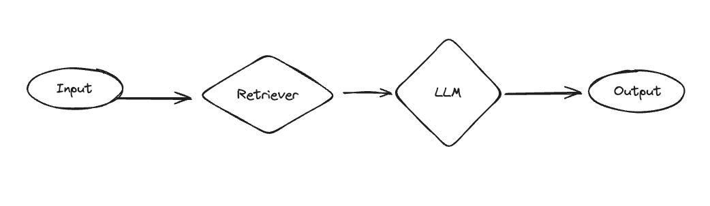{fig-align="center"}

LLMs generate responses to users' inputs by:

- __retrieving__ most relevant data from an external source
- __augmenting__ query with retrieved data
- __generating__ response based on augmented query

## :shirt: Pattern 2: "retrieve & generate" {auto-animate="true"}

{height=125 .absolute right=0 top=0}

:::{style="margin-top: 100px"}
This pattern is currently used as a solution to limited context windows and  hallucinations. 

It is usually effective for tasks focussing on __information retrieval__ and __question answering__
:::

## :shirt: Pattern 2: "retrieve & generate" {auto-animate="true"}

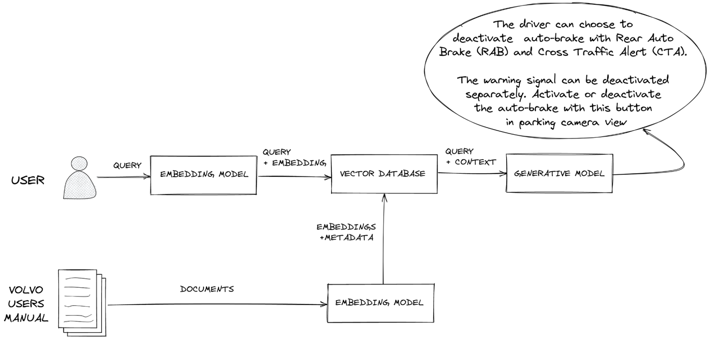{fig-align="center"}

<p class="footnote">
_figure taken from [Pinecone's blog on Retrieval Augmented Generation](https://www.pinecone.io/learn/retrieval-augmented-generation/)_<p>

## :angel: Pattern 3: "agent / assistant"

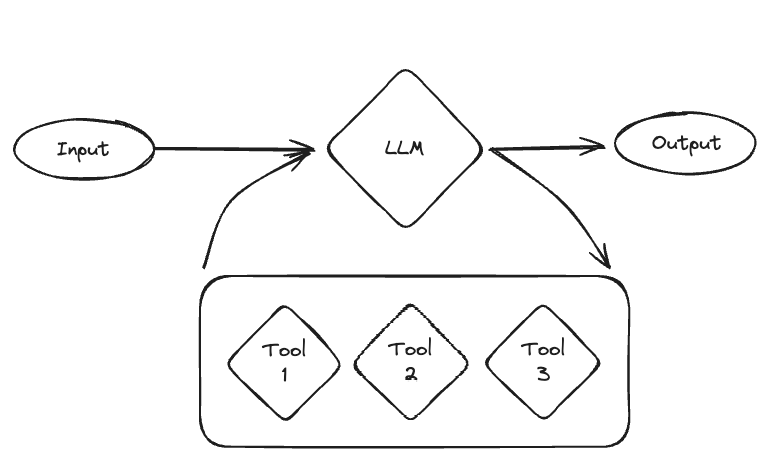{fig-align="center"}

An LLM is equipped with an arbitrary amount of tools and decides which tool to use to generate a response to a users' inputs

## :high_brightness: Towards a unified cognitive architecture?

{fig-align="center"}

<p class="footnote">
_figure taken from [LLM Powered Autonomous Agents](https://lilianweng.github.io/posts/2023-06-23-agent/)_<p>

## :eyes: From LLMs to LMMs

{fig-align="center"}

It is likely that future cognitive architecture will leverage __multimodal__ models capable of handling multiple input-output modalities 

<p class="footnote">
_figure taken from [ImageBind: Holistic AI learning across six modalities](https://ai.facebook.com/blog/imagebind-six-modalities-binding-ai/) 
_<p>

# :moneybag: Business implications

## :briefcase: Leveraging GenAI models in your organisation {.smaller}

{fig-align="center" height=300}

Before you start, the following [key questions](https://huyenchip.com/2023/06/07/generative-ai-strategy.html) should be considered: 

- __If I don’t do anything__: 

    - can competitors using GenAI models make me obsolete ?
    - will I miss out on opportunities to e.g. boost revenue ?

- __If I do something__: 

    - what are the risks ?
    - what are the costs ? 
    - what are the benefits ?

## :bookmark: Understand key behaviours / dealbreakers of GenAI models {.smaller}

When working with GenAI models, it is good to be mindful of the following:

- __ambiguity of inputs and outputs__:
    - how do we ensure consistency ?
- __hallucination vs factuality__:
    - does it matter ?
    - if so, how do we ensure that the generated content is factual ?
- __context length__:
    - a significant proportion of information seeking questions have context-depends answers 
- __forward and backward compatibility__:
    - how do we ensure that your prompts work with the newer model versions ?
- __cost at inference time__:
    - can we afford to use LLMs for our use case ?
- __efficiency of chat as a universal interface__:
    - is chat the right interface for our use case ?

## :blossom: Using GenAI models responsibly {.smaller}

:::: columns

::: {.column width=40%}
{fig-align="center" height=600}
:::

::: {.column width=60%}

There are important aspects to consider when using __GenAI models__:

- __trustworthiness__ -- is a system:

    - fair and impartial ?
    - robust and reliable ?
    - explainable ? 
    - secure ?
    - safe ?
    - private ?
    - accountable ?
    - responsible ?

- __legal__:

    - are there any intellectual property / regulatory implications ?

- __organisational impact__:

    - how will it impact the people ?

- __environmental impact__:

    - it is consistent with the wider sustainability goals ?
:::
::::

<p class="footnote">
_image generated using [Stable Diffusion v2](https://huggingface.co/stabilityai/stable-diffusion-2) with a prompt: `a forest path` and extended with Runway's [Expand Image](https://runwayml.com/ai-magic-tools/infinite-image/)_ <p>

## :busstop: Pathways for leveraging large language models in your organisation

:::: columns

::: {.column width=40%}
{fig-align="center" height=600}
:::

::: {.column width=60%}
Generally, there are two key __technical pathways__ in which __GenAI__ models could be leveraged in most organisations:

1. build in-house solutions that leverage:

    - open-source models
    - closed-source models

2. use third-party solutions, e.g. SaaS / PaaS offerings

$\implies$ most businesses should only do what makes their beer taste better
:::
::::

<p class="footnote">
_image generated using [Stable Diffusion v2](https://huggingface.co/stabilityai/stable-diffusion-2) with a prompt: `work construction` and extended with Runway's [Expand Image](https://runwayml.com/ai-magic-tools/infinite-image/)_<p>

## :pizza: :ramen: :hamburger: Takeaways for executives

Use Chip Huyen's [advice](https://huyenchip.com/2023/06/07/generative-ai-strategy.html) on developing products and services leveraging LLMs: 

1. :dart: set concrete goals
2. :book: work out your data story
3. :money_with_wings: invest in thing that last
4. :microscope: experiment with APIs, build with open source
5. :white_check_mark: understand key behaviours and dealbreakers
6. :red_car: choose a model size that balances cost and performance
7. :necktie: tie model evaluation to business metrics
8. :tada: have fun

## :rocket: Tips and tricks

Current AI tools are an excellent productivity booster; here's the tools that I find particularly useful in 2025:

- [NotebookLM](https://notebooklm.google/) -- summary and Q&A with files
- [Claude Code](https://www.claude.com/product/claude-code) / [GitHub Copilot](https://github.com/features/copilot) -- code generation and explanation
- [WhisprFlow](https://wisprflow.ai/) -- AI-powered transcription and note-taking
- [Deep Research](https://gemini.google/overview/deep-research/) -- agentic (re)search assistant

## :rocket: Tips and tricks -- choosing the right "chatbot" model

Evaluation and comparison platform, [lmarena](https://lmarena.ai/) is a useful tool to compare different LLMs across prompts of your choice.

While it relies on human preference for evaluation, this is a good way to quickly shortlist models for your use case.

## :rocket: Tips and tricks -- prompt engineering

The more you prompt, the better you get at prompting


However, if you know Polish you might have the upper hand based on this [paper](https://arxiv.org/pdf/2503.01996):

> Surprisingly, English is not the top-performing language on long-context tasks (ranked 6th out of 26), with Polish emerging as the top language.

## :rocket: Tips and tricks -- prompt engineering

